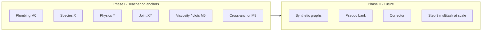
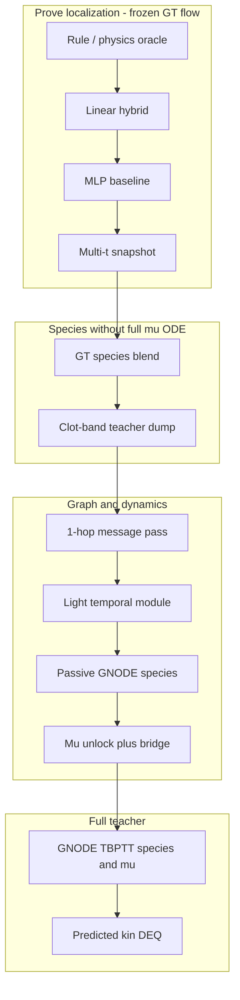

# Biochem training plan

Structured roadmap for **Phase 3 biochem** (`train_biochem_corrector.py`): what to prove, in what order, and how to debug by **isolating** objectives before combining them.

**Companion docs (living evidence, not the plan):**

| Doc | Role |
|-----|------|
| [BIOCHEM_TRAINING_PROGRESS.md](BIOCHEM_TRAINING_PROGRESS.md) | Run chronicle, gate checklist, run log table |
| [PASSIVE_KIN_BLOCKER_CHECKLIST.md](PASSIVE_KIN_BLOCKER_CHECKLIST.md) | Kin-blocked passive backlog while `GT_KINE_VEL=1` |
| [CLOT_PHI_BASELINE.md](CLOT_PHI_BASELINE.md) | Wall-local clot phi (downstream of species teacher) |
| [PROJECT_CONTEXT.md](PROJECT_CONTEXT.md) | Architecture and data layout |

**Rule of thumb:** Change **one axis per leg** (loss term, mask, init, or LR). Log outcomes to the progress doc after each batch of runs.

### Probe vs promote vs scale

Early Phase I work is **not** about final model quality. It is about **trends**, **pass/fail signals**, and **catching bugs** (wrong mask, preset clobber, flow trivial, loss not wired). Scale training only when a probe matrix has picked a recipe worth promoting.

| Tier | Typical epochs | Time / leg | Purpose | When to run |
|------|----------------|------------|---------|-------------|
| **Probe** | **2-4** | ~10-20 min | Compare curves in `run.jsonl`; gates use **relaxed** thresholds (`--probe`) | Default for I.1 X3-X6, I.2 Y, most mask/LR/isolate ablations |
| **Calibration** | **12-20** | ~1-2 h | One **canonical init** per recipe family (e.g. align locked) | Once per stable recipe; not every ablation |
| **Promote** | eval + dump (+ optional short confirm) | ~30-90 min | Lock ckpt + species dump for clot-phi | Only after probes agree on mask/weights/init |
| **Scale** | 6h ladders, 20ep reruns | hours | Architecture A/B with a **written hypothesis** | When probes cannot separate two designs |

**Do not** treat probe FAIL on saturated inits (FI already ~0.03, flat `L_bio`) as a recipe bug -- reset init to `biochem_teacher_passive_align_locked.pth` each leg. **Do** treat flow trivial, exploding grads, or FI regression vs ep0 as hard fails.

**Default launchers:** `go_passive_x_probe.ps1` (**-Turbo**, target **<30 min**). **Full matrix:** `go_passive_x_iterate.ps1 -Turbo:$false`. **Promote I.1:** `go_passive_x_block_finish.ps1 -Promote`.

**Turbo env** (`_passive_x_block_env.ps1`): 2ep, 3 legs (X4/X5/m3 union), `VAL_TIME_STRIDE=50`, `TEACHER_VAL_EVERY=2`, `PASSIVE_SPECIES_VAL_ONLY=1` (one rollout/anchor, no duplicate mu val). Training code also reuses rollout for species when full val runs.

---

## Two program phases

| Phase | Goal | Pipeline | Status |
|-------|------|----------|--------|
| **I — Teacher** | Anchor-only teacher that predicts **species (FI/Mat)** and **viscosity / clot fields** well enough to dump reliable anchors and support clot-phi | `STOP_AFTER_TEACHER=1`, GT flow until kin is ready | **Active** — species strong; bulk mu unlock ~0.80; wall/high + viz clots open |
| **II — Synthetic + corrector** | Train on **mixed anchor + synthetic** graphs with pseudo labels from a frozen teacher | `STOP_AFTER_TEACHER=0`, corrector loop | **Not started** — blocked on Phase I teacher quality |

Phase II is intentionally **out of scope** for current iteration. Do not enable `thrombus_corona` or large `STOP_AFTER_TEACHER=0` runs until Phase I promotion criteria are met.

---

## Milestone checklist (M0–M8)

| Milestone | Status | Evidence / gap |
|-----------|--------|----------------|
| **M0 Plumbing** | **Done** | `run.jsonl`, `runs_index.jsonl`, `go_*` launchers, `_python_rc.ps1`, passive/explore env, gate scripts, explore summarize |
| **M1 Supervised species** | **Pass (passive)** / **Partial (clot-phi)** | 20ep align: val FI **2.01->0.029**; **I.1 X block done** (§131): `species_locked` + dump `anchors_stride36_m6`. Gap: clot-phi min F1 not yet on new dump |
| **M2 Passive co-train (step 2a)** | **Pass (20ep)** / **Partial (ramp2)** | Locked align; `L_bio` + masked `ADR_S` co-descent. Gap: global/raw `ADR_S` in combined ramp2 still ~2.26e6 |
| **M3 Analytical ADR alignment** | **Pass (viability)** / **Optimize later** | **Proved viable:** §132 + `check_m3_viability_pass.py`. **Further optimization:** global ramp2 ADR, narrow/sweep, bridge training from saturated init (§133), production hyperparams — not required to proceed I.3 XY |
| **M4 Predicted kinematics** | **Not solved** | All biochem wins use `GT_KINE_VEL=1`. Stage-A kin is a parallel track |
| **M5 Viscosity / clot teacher** | **Partial** | Mu-unlock **all ~0.80**; isolates **~0.40–0.49** on patient007. Gap: wall/high finetune noop; viz localized clots poor |
| **M6 Corrector / synthetic** | **Not started** | Phase II |
| **M7 Full multitask (step 3)** | **Not solved** | K2 val **~4.2** vs K1 **~0.46** |
| **M8 Cross-anchor gate** | **Partial** | GT-flow round2 **min F1 0.357** (pass 0.34). Gap: retrain protocol + new teacher dumps |

**Current focus (2026-05-31):** **Viscosity ladder rungs 0–2** (clot-φ localization on GT flow) before more GNODE μ work. Passive species (M1) and bridge mu (~0.78 logMAE) are **not** proof of spatial clots — use this ladder for promotion. See [Viscosity ladder (rungs 0–11)](#viscosity--clot-localization-ladder-rungs-011) below.

### M3 — viability vs optimize-later

**Viability (done when components co-train):** species + **masked** analytical ADR on the supervision band with GT flow; recipe: `phaseB_ramp1` init -> `go_m3_align_probe.ps1` with `union` + `transport_only` + `match_data_bio` + `exclude_wall`, `PASSIVE_ADR_WEIGHT=1e-4`.

**Evidence:** `m3_align_transport_union_12ep` (§132) and/or `passive_align_20ep` (§126) — `check_m3_align_gate.py` **PASS**; val FI **~0.03**; masked `L_bio` + `L_ADR_S` ratios **&lt;0.15**. I.3 bridge from `passive_m3_locked` holds species **~0.027** (§133).

**Re-verify viability:** `python scripts/check_m3_viability_pass.py`

**Further optimization required (not blocking I.3 XY viability):**

- Generic Phase B **ramp2** with **global** raw `ADR_S` (~1e6 console) — use masked union recipe in production, not global PASSIVE ramp2.
- Full **narrowing** / **mask sweep** ladders and locked `passive_m3_locked.pth` naming.
- ADR weight, epoch budget, train-anchor tables, GT audit archive.

### M3 block chunks (reference; full sweep = optimize-later)

| Chunk | Viability? | Notes |
|-------|------------|--------|
| M3.1–M3.2 seed + ramp1 | **Done** | `species_locked` -> `phaseB_ramp1_last` |
| M3.4 cal align 12ep | **Done** | `m3_align_transport_union_12ep` |
| M3.0 audit, M3.5–M3.7 sweep/lock | **Later** | Ablation + canonical ckpt when tuning |

**Quick probe:** `go_m3_block_pass.ps1 -Probe` (~30-45m trends).

**Full optimization block (optional):** `go_m3_block_pass.ps1` `-Turbo` (~3-5h).

---

## Viscosity / clot localization ladder (rungs 0–11)

**Goal:** A model that predicts **viscosity over time** with **localized clot patches** (between bulk fluid and wall-flood failure modes), then scale to full **GNODE-ODE teacher** and predicted kinematics.

**Strategy (2026-05-31):** Prove **where** and **μ level** on **frozen GT flow** first (clot-φ), then time, then species supply, then graph/ODE — not full biochem rollout first. **GNODE biochem has not** demonstrated intermediate clots in viz despite ~0.47–0.78 global `mu_log_mae`; **clot-φ MLP** has (patient007 F1 ~0.48; GT-flow multi-anchor **min F1 0.357**). Evidence: [CLOT_PHI_BASELINE.md](CLOT_PHI_BASELINE.md), [BIOCHEM_TRAINING_PROGRESS.md](BIOCHEM_TRAINING_PROGRESS.md) §98–103, §135–137.

**Metrics:** Prefer **mask F1 / recall / `pred+`**, high-μ subset logMAE, and **qualitative patches across time** — not global `mu_log_mae` or `viz_final_mu2_mean` alone.

**Mask recipe (carry through all rungs 0–7):** `neighbor` shell + `CLOT_PHI_DGAMMA_SLICE=1` @ `t=0` + center exclude; minimal features `[sdf, log10(gamma_dot), log1p(-dgamma/dx)]`. Details: [CLOT_PHI_BASELINE.md](CLOT_PHI_BASELINE.md).

### Rung 0–2 — Prove “between no clot and wall clot” (**current**)

| Rung | What | Pass criterion |
|------|------|----------------|
| **0** | Physics oracle (`CLOT_PHI_PHYSICS_ORACLE`, `mu_ratio_max=4`) | F1 ~**0.48**, healthy `pred+` — mask/labels OK — **PASS** p007 val F1 **0.599**, `pred+=0.331` (§138) |
| **1** | Linear hybrid, same mask | Within ~**0.02** F1 of MLP — problem is not depth — **PASS** p007 val F1 **0.712** (§139) |
| **2** | MLP baseline | patient007 F1 **>= 0.47**, recall **>= 0.40**, `pred+` not collapsed — **PASS** F1 **0.767**, `pred+=0.524` (§140) |

**Launcher:** `scripts/go_clot_phi_simple.ps1` (`-Model linear` / `-Model mlp`, `-Fresh`).

### Rung 3 — Viscosity over time (still simple)

Clot-φ already trains **per timestep** (`CLOT_PHI_TIME_STRIDE`, multiple `ti`) with **shared weights** — that is **μ(t) given GT u,v(t)**, not an ODE.

| Add-on | Purpose |
|--------|---------|
| **3a** | Stride 1 on one anchor; viz μ at early / mid / late T |
| **3b** | Temporal smoothness on φ or Δlog μ between adjacent `ti` |
| **3c** | Optional 1-step carry: `φ_t = f(φ_{t-1}, features_t)` (tiny GRU) — only after **3a** looks right |

**Gate:** Patches **appear, grow, and stay localized** on patient007 across time; not a single-frame fit. **3b pass (2026-05-31):** t=200 localized; t=0 `mean_pred_phi=0.18` on `region_n=83` (`frac_pred_phi>=0.5` ~0.11), not wall flood (§142).

**Rung 3a/3b (2026-05-31):** Frozen **dgamma@0** in features -> wall flood (**§141**, fail). **`CLOT_PHI_DGAMMA_FEATURE_TIME=current`** -> localized patches, F1 **0.774**, `region_n=303` @ t=200 (**§142**, pass). Always **`dot-source _clot_phi_shared_env.ps1`** or use fixed `viz_clot_phi_simple` (sets `DGAMMA_SLICE=1`). Default recipe going forward: **3b** env on train + viz.

### Rung 4–5 — Species without betting on GNODE μ

| Rung | What | Gate |
|------|------|------|
| **4** | GT species + `joint_blend_gtsp` | Multi-anchor **min F1 >= 0.35** (achieved **0.357** on adapt cache; gt-flow round2) |
| **5** | Clot-band passive teacher -> dump -> clot-φ | **min F1 >= 0.26** with adapt `min_steps` (achieved **0.262**); push teacher FI **in the band** |

**Do not** promote **K10E-from-bridge** ckpts for joint teacher (species destroyed; progress §136). Launchers: `go_gt_flow_round2_4h.ps1`, `go_clot_phi_biology_round2.ps1`, clot-band passive (`BIOCHEM_DATA_BIO_MASK_MODE=clot_band`).

### Rung 6 — Coupled clot-phi rollout (MLP macro loop, pre–full GNODE)

Serial loop like biochem macro stepping, but clot head replaces species ODE:

| Sub | What | Flow |
|-----|------|------|
| **6a** | GT `[u,v](t)` + **carry** `phi_{t-1}`, `log mu_{t-1}` | Tests **viscosity over time** without flow error |
| **6b** | `MU_PRIOR = mu_{t-1}` -> **RGP-DEQ** -> MLP features | Two-way clot–kinematics; optional `CLOT_PHI_KINE_TF` blend |

Doc: [CLOT_PHI_ROLLOUT.md](CLOT_PHI_ROLLOUT.md). Launchers: `go_rung6a_clot_phi_rollout_gt.ps1`, `go_rung6b_clot_phi_rollout_kine.ps1`.

**Gate:** late-`T` patches grow (e.g. second GT layer); p007 F1 not worse than rung 3b/4 by >0.05; 6b must beat frozen-GT ablation on at least one weak anchor.

### Rung 7–8 — Minimal graph / dynamics (pre–full GINO)

| Rung | What | Why |
|------|------|-----|
| **7** | 1–2 layer message passing on supervision nodes only | Neighbor conv without DEQ/ODE |
| **8** | Optional GRU on carry (if 6a carry insufficient) | Explicit temporal state |

*(Rung 7–8 not implemented yet.)*

### Rung 9–9.9 — GNODE-ODE (component ladder, GT velocity)

**Full breakdown:** [GNODE_ODE_LADDER.md](GNODE_ODE_LADDER.md) — rungs **9.0–9.9** (simplest forward smoke -> pretrain -> 3ep probes -> passive -> dump/clot-phi -> ADR -> mu -> bridge -> full teacher).

| Rung | What | Gate (trend) |
|------|------|----------------|
| **K0** | Retrain `kinematics_best.pth` | Steady kin OK on p007 (unblocks 6b + 9.x) |
| **9.0** | RGP-DEQ only (no GNODE train) | 5 min viz |
| **9.1–9.3** | GNODE smoke, pretrain, 3ep DATA_BIO | Forward OK; FI trending down |
| **9.4** | Passive transport (~12ep) | Val FI **< 0.05** |
| **9.5** | Fast dump + clot-phi | min F1 **>= 0.26**; patches |
| **9.6–9.8** | ADR backprop, mu unlock, bridge | Species held; check clot-phi not biochem viz |
| **9.9** | Full clot_band teacher | Dump beats 9.5 |

**Fast default launchers:** `go_passive_transport.ps1`, `go_passive_transport_clotband_focus.ps1` (short `-TeacherEpochs 8 -DumpStride 72`), `go_passive_step2_bridge.ps1 -GradScaleOnCap -Probe`.

### Rung 10–11 — Predicted flow + Phase II

| Rung | What | Gate |
|------|------|------|
| **10** | GNODE + **predicted** kine (not GT vel) | Same clot-phi gates as 9.5; compare to **6b** |
| **11** | Corrector / synthetics (Phase II) | After 9.9 + cross-anchor clot gates |

**Phase II** (synthetics + corrector) stays **after rung 10** passes **cross-anchor** clot gates, not patient007 only.

### What to stop doing (for this goal)

1. Using **global `mu_log_mae`** or **`viz_final_mu2_mean`** as proof of clots.
2. Training **full ODE + explicit gelation** before localization is proven (bulk flood / flat `learned` Δμ).
3. **K10E mu-only** legs on bridge ckpt for joint teacher use.
4. **Bridge without `-GradScaleOnCap`** (no-op; progress §137).
5. Expecting **biochem teacher viz** alone to show partial clots — use **clot-φ** until rung 10.

### Map ladder rungs to plan milestones

| Ladder | Milestones |
|--------|------------|
| 0–3 | M8 prep (localization + time); parallel to M5 viz gap |
| 4–5 | M8 cross-anchor clot-φ |
| 6a–8 | M8 clot time / graph (optional) |
| K0, 9.0–9.9 | M1–M2 passive GNODE ladder ([GNODE_ODE_LADDER.md](GNODE_ODE_LADDER.md)) |
| 10–11 | M4 kin + M5 full teacher |
| After 9.9 | M6 Phase II |

---

## Isolation framework (X, Y, XY)

Debug by separating **what is supervised in backward** from **what is only logged**.

| Track | Meaning | Typical `LOSS_ISOLATE` / backward | Trainable (usual) |
|-------|---------|-----------------------------------|-------------------|
| **X** | **Species / data bio** — FI, Mat, bulk substance on COMSOL anchors | `PASSIVE`, `DATA_BIO`, or step-2 `L_Data_Bio` in `LOSS_DATA_ONLY` | Bio encoder, decoder, ODE |
| **Y** | **Single physics / mu term** — one knob at a time | `ADR_S`, `ADR_F`, `W_BIO`, `W_PHY`, `MU_LOG`, `MU_SI`, … | Term-dependent; mu legs often **freeze bio** |
| **XY** | **Combination** — joint step-2, bridge, ramps, mu-unlock + species guard | `LOSS_DATA_ONLY=1` + weights; or `PASSIVE` + ADR weight | Multi-group per recipe |

**Always fix flow first:** `BIOCHEM_GT_KINE_VEL=1`, `BIOCHEM_GT_KINE_SKIP_DEQ=1`, `BIOCHEM_TEACHER_FORCE_MIN=1` for passive/GT-flow work.

**Orchestrated ladder:** [scripts/go_passive_explore_6h.ps1](../scripts/go_passive_explore_6h.ps1) runs X -> Y -> XY legs; [scripts/_passive_explore_base_env.ps1](../scripts/_passive_explore_base_env.ps1) sets clean env (no `passive_transport` preset clobber).

### Gate scripts (per track)

| Track | Gate | Pass means |
|-------|------|------------|
| X / XY (species+ADR) | `check_m3_align_gate.py` | `L_bio` and masked `ADR_S` ratios; species FI stable. **Caveat:** false FAIL if init already saturated (~2275 `L_bio`) |
| X / XY (species only) | `val_species_fi_log_mae`, train-anchor eval | FI **~0.03** on val + train anchors |
| Y | `check_phase_a_gate.py --mode y --term <TERM>` | Isolated train loss monotone / non-trivial |
| XY bridge | `check_passive_step2_bridge_gate.py` | `passive_step2_bridge=1`, species OK, mu stable |
| XY mu-unlock | `check_passive_mu_unlock_gate.py` | Val all logMAE drop; species FI **~0.03** |

### Metrics that matter (ignore misleading ones)

| Use | Do not use alone |
|-----|------------------|
| Val `mu_log_mae` (all / wall / high-mu), `mu_pearson` | Train `L_kine` for mu success |
| Val `val_species_fi_log_mae`, train-anchor FI/Mat | Train `L_bio` when bio is frozen |
| Train `L_Back` / isolated term under `LOSS_ISOLATE` | Global raw `ADR_S` when mask is clot-band |
| Preflight median logMAE | `L_tot` under step-3 Kendall |

---

## Loss function catalog

**Enforced in code:** [biochem_loss_policy.py](../src/training/biochem_loss_policy.py) (`BIOCHEM_LEGACY_LOSSES=1` for old sweeps).

**Source of truth (implementation):** `compute_biochem_loss()` and `_biochem_resolve_isolated_loss()` in [train_biochem_corrector.py](../src/training/train_biochem_corrector.py). **Evidence:** [BIOCHEM_TRAINING_PROGRESS.md](BIOCHEM_TRAINING_PROGRESS.md) run table + chronicle + **Loss policy** section.

### How losses enter `backward`

| Mode | Env | Backprop sum |
|------|-----|--------------|
| **Isolate** | `BIOCHEM_LOSS_ISOLATE=<TERM>` | Single term (or composite below) |
| **Step 2 data-only** | `BIOCHEM_LOSS_DATA_ONLY=1`, no isolate | `L_Data_Kine + L_Data_Bio + W_MuSI*L_MuSI + W_MuLog*...` (+ optional `L_PhysTemp`, passive ADR) |
| **Step 3 multitask** | `BIOCHEM_COMPLEXITY_STEP=3` | Kendall-weighted 8 tasks + aux terms |
| **Passive preset** | `LOSS_ISOLATE=PASSIVE` | `w_bio*L_Data_Bio + w_kine*L_Data_Kine` [+ ADR if `PASSIVE_ADR_BACKPROP=1`] |

### A. Pretrain (before teacher loop)

| Metric | What | Tested? | Performance |
|--------|------|---------|-------------|
| AE recon + latent reg | Huber on normalized bio channels | Yes (default pipeline) | Standard warm-start; skipped when `SKIP_PRETRAIN=1` |
| ODE-RXN mimic | Reaction path on latent | Yes | Plateau-driven; not primary μ/species gate |

### B. Eight Kendall tasks (`DynamicLossWeighter`, step 3)

| # | Metric | Physics | Isolate key | Tested? | Performance (patient007 unless noted) |
|---|--------|---------|-------------|---------|--------------------------------------|
| 0 | `L_ADR_F` | Fast ADR residual | `ADR_F` | **Yes** (Phase A Y, explore `Y_ADR_F`) | Train loss **~1e4 -> ~4e2** @ LR=1e-3, clip=10 (§107); val mu flat **1.3966** |
| 1 | `L_ADR_S` | Slow ADR residual | `ADR_S` | **Yes** (Phase A Y, explore `Y_ADR_S`, m3n) | **Masked** co-descent **0.007->0.0003** (20ep align §126); **global** raw **~2.26e6** flat in ramp2 |
| 2 | `L_W_Bio` | Wall bio flux | `W_BIO` | **Yes** (explore `Y_W_BIO`) | Phase-A gate **WARN** (trivial/rebound); not reliable alone |
| 3 | `L_W_Phy` | Wall physics flux | `W_PHY` | **Yes** (explore `Y_W_PHY`, Phase A) | Train **~0.6->0.1** with clip=10; finicky |
| 4 | `L_B_IO` | Bio in/out | `BIO_IO` | **Partial** (Phase A seed) | Numerical descent; **val mu flat** |
| 5 | `L_mom` | NS momentum residual | `NS_MOM` | **Little** | Dominated by step-3 runs; not isolated success |
| 6 | `L_Data_Kine` | Supervised u,v,p,mu on anchors | `DATA_KINE` | **Yes** (K1, I4, K10e aux) | Val logMAE **~0.47-0.49** with mu-path + delta head (§90) |
| 7 | `L_Data_Bio` | Supervised FI/Mat/species | `DATA_BIO` | **Yes** (passive, I3, 20ep) | Val FI **2.01->0.029**; train `L_bio` **16.6k->225**; **val mu flat** when mu not in loss |

### C. Mu / viscosity aux terms (added outside Kendall index)

| Metric | Isolate / access | Tested? | Performance |
|--------|------------------|---------|-------------|
| `L_MuSI_aux` | `MU_SI` (bundle) | **Yes** | Best **~0.44** ep3 (Phase B / I2); competes with MU_LOG |
| `L_MuLog_aux` (all-truth) | `MU_LOG` | **Yes** | **~0.40-0.49** isolates; passive unlock **0.80**; finetune **noop** |
| `L_MuLog_wall` | `MU_LOG_WALL` | **Yes** (sweeps) | Can move wall to **~2.09** but **hurts** all/high (**~0.66-0.70**) |
| `L_MuLog_high` | `MU_LOG_HIGH` | **Yes** | High-tail **0.94->0.58** isolate; **no** spatial clots; all-truth poor alone |
| `L_MuMSE` | `MU_MSE` / `MU_DATA` | **Yes** (K10d) | Proof path for delta-mu SI head |
| `L_MuLog_adjacent` | part of `K10E` | **Yes** (K10e) | Wall-adjacent band; logMAE **~0.47-0.49**; **viz clots still flat** |
| `L_MuWall_bypass` | in `MU_LOG` | Partial | Used in MU_LOG bundle |
| `L_MuLog_boundary` | step-2 only | Little | Optional boundary weight |
| K10E bundle | `K10E` | **Yes** | Adjacent + bulk delta + small DATA_KINE |

### D. Other aux terms

| Metric | Isolate | Tested? | Performance |
|--------|---------|---------|-------------|
| `L_PhysTemp` | `PHYS_TEMP` | **Yes** (overnight B) | **No val mu gain** vs baseline step-2 |
| `L_KinePrior` | `KINE_PRIOR` | Little | Carreau/clot-risk prior; not main lever |
| `L_Latent_Reg` | `LATENT` | Default on | ODE derivative energy; scaled |
| `L_Visc_Reg` | `VISC` / `VISC_REG` | Little | Curriculum viscosity reg |
| `L_Pseudo` | `PSEUDO` | **No** (corrector) | Phase II — teacher frozen |
| `L_FIGateStart` | `FI_GATE` | Little | FI gate start penalty |
| `L_ResidualSparse` | `RES_SPARSE` | Little | Sparse residual reg |
| Trigger floors/sparse/nuc | env weights | **Yes** (K11/clot6h era) | **Fail** viz: `gate_all` collapses, `clot_frac->0` (§112) |

### E. Composite isolate modes

| Isolate | Composition | Tested? | Performance |
|---------|-------------|---------|-------------|
| `PASSIVE` / `ONE_WAY` | `w_bio*L_Data_Bio + w_kine*L_Data_Kine` [+ ADR] | **Yes** | **ADR in backward early:** grad explode, `L_bio` flat; **`PASSIVE_ADR_BACKPROP=0`:** species pass; masked ADR co-descent @ 20ep |
| Step-2 `LOSS_DATA_ONLY` | data + mu weights (+ bridge ADR) | **Yes** | Bridge: species **0.027**, mu **flat 1.3966** under `mu_ratio_max=1` |
| Step-3 Kendall sum | all 8 tasks | **Yes** (K2) | Val **5.58->4.22** — **regress** vs K1 **0.46** |

### F. Legacy / separate tracks

| Name | Notes | Tested? | Performance |
|------|-------|---------|-------------|
| **K11 clot gate** | Documented sweeps used `LOSS_ISOLATE=K11` (clot BCE); **not** in current `_biochem_resolve_isolated_loss` valid list — verify script before re-run | **Yes** (clot6h) | **Fail** localized viz; wall halo; `gate` collapse |
| **Clot-phi** (`train_clot_phi_simple`) | Separate model on dumped species — not a `train_biochem_corrector` loss | **Yes** | GT-flow **min F1 0.357**; patient007 F1 ~0.48 simple baseline |

### G. Quick map: X / Y / XY vs losses

| Track | Primary losses | Status |
|-------|----------------|--------|
| **X** | `DATA_BIO`, `PASSIVE` (data part) | **Pass** species (~0.03 FI) |
| **Y** | `ADR_*`, `W_*`, `MU_LOG`, `MU_SI`, ... | **Partial** — ADR_S/F and MU_LOG pass; W_BIO/W_PHY finicky; wall/high noop at plateau |
| **XY** | `LOSS_DATA_ONLY`, bridge ADR, unlock+bridge | **Partial** — unlock **0.80** mu; bridge species OK; analytical ADR global still open |

**Not tested / defer:** `PSEUDO`, full corrector mix, step-3 at production quality, teacher without `GT_KINE_VEL`, most trigger/sparse clot priors at scale.

---

## Phase I — Teacher (viscosity + species on anchors)

### I.0 — Plumbing (M0) [done]

- Compact logging, run index, promote/lock ckpt scripts, pytest preflight on launchers.
- **Promotion paths:** `biochem_teacher_passive_align_locked.pth`, `expl6h_*_last.pth`, `biochem_teacher_passive_mu_unlock_best.pth`.

### I.1 — X: Species lane (M1)

**Goal:** COMSOL **FI / Mat** on anchors with **frozen GT flow** and **no clot feedback** (`TEACHER_MU_RATIO_MAX=1`). **Probe goal:** see FI trend / isolate bugs; **promote goal:** dump for clot-phi only after probes pick a recipe.

| Step | ID | Tier | What to test | Launcher | Pass (probe) | Pass (promote) |
|------|-----|------|--------------|----------|----------------|----------------|
| 1 | X0 | probe | GT flow sanity | `go_passive_transport.ps1` (short) | `flow_trivial=0`, `t0|u|~0.96` | — |
| 2 | X1 | **calibration** | Union mask + `transport_only` ADR | `go_m3_align_probe.ps1` -> `go_passive_align_20ep.ps1` | — | `check_m3_align_gate`; val FI **<0.05** |
| 3 | X2 | **calibration** | Lock canonical init | `go_passive_lock_align_ckpt.ps1` | — | `biochem_teacher_passive_align_locked.pth` |
| 4 | X3 | probe (3ep) | Mask ablation | `go_passive_x_iterate.ps1` | `check_passive_x_species_gate --probe`; compare `run.jsonl` | — |
| 5 | X4 | probe (3ep) | `DATA_BIO` vs `PASSIVE` | same | FI not worse vs ep0; note `L_bio` path | — |
| 6 | X5 | probe (3ep) | FI/Mat weights | same | No FI regression vs ep0 | — |
| 7 | X6 | probe | Train-anchor table | `eval_passive_species_anchors.py` on locked init | Informational FI table | — |
| 8 | X7 | **promote** | Dump for clot-phi | `go_passive_x_block_finish.ps1 -Promote` | — | Train anchors FI **<0.04**; `anchors_stride36_m6` |

**Done (calibration):** X1–X2 (20ep align). **Done (probe + promote, 2026-05-30):** X3–X5 + `X_m3_union` turbo 2ep (`go_passive_x_probe.ps1`); promote from `passive_align_locked` -> `biochem_teacher_passive_species_locked.pth` + dump `outputs/biochem/x_block/anchors_stride36_m6/` (6 graphs); `check_passive_x_block_pass.py --require-promote` **PASS**. Probe val FI (trend only): X3 **0.018**, X4/X5/m3 **~0.065**; teacher quality = 20ep cal **~0.03**. X6 confirm skipped (promote uses calibration ckpt). **Re-verify:** `python scripts/check_passive_x_block_pass.py --require-promote`.

**Default session (probe matrix, ~30 min turbo):** `go_passive_x_probe.ps1`. **Promote:** `go_passive_x_block_finish.ps1 -Promote`. **Full pass (probe + promote):** `go_passive_x_block_pass.ps1`.

### I.2 — Y: Isolated terms (M2 / M3 debug)

**Goal:** Prove each **backward term can move** (probe, **3-4 ep**) before XY joint training. Use `check_phase_a_gate.py --mode y` with **trend** interpretation; do not run 8ep+ Y legs unless comparing two architectures.

| Step | ID | Term | Tier | Pass (probe) |
|------|-----|------|------|--------------|
| 1 | Y1 | `ADR_S` + `transport_only` | probe | Masked ADR down or flat FI; no explode |
| 2 | Y2 | `ADR_F` | probe | Term loss moves; watch clip |
| 3 | Y3 | `W_BIO` / `W_PHY` | probe | Non-trivial loss (rebounds OK in probe) |
| 4 | Y4 | `MU_LOG`, bio frozen | probe | Mu metric moves; FI not worse vs ep0 |
| 5 | Y5 | wall/high weights | probe | **Often noop at plateau** -- stop after 3ep; change recipe, do not extend epochs |
| 6 | Y6 | ADR formulation | probe | 3ep m3n-style compare only |

**Done (explore 6h):** Y1–Y4 signals. **Failed / noop:** Y5 finetune at plateau (extend training did not help).

### I.3 — XY: Combine species + physics (M2 joint, M3, M5)

**Goal:** Step-2 teacher — species + modest mu + optional masked ADR — **without** step-3 Kendall.

| Step | ID | Recipe | Launcher | Pass criteria |
|------|-----|--------|----------|---------------|
| 1 | XY0 | Phase B ramp1 (data only) | `go_phaseB_xy_passive.ps1` (ramp1) | `L_Data_Bio` clear drop |
| 2 | XY1 | Ramp2 (+ADR backprop, low weight) | ramp2 leg | Data down; **masked** ADR co-descent (not global ADR alone) |
| 3 | XY2 | **Step-2 bridge** | `go_passive_step2_bridge.ps1` / `go_passive_xy_block_pass.ps1` | **Pass** (§134): species **~0.01-0.02**, co-descent, mu flat |
| 4 | XY3 | **Mu-unlock** then bridge | `go_passive_mu_unlock_probe.ps1` -> bridge from **unlock** ckpt | All logMAE **~0.80**; species held |
| 5 | XY4 | Low ADR in backward | explore `XY_adr_low` | Species stable + masked ADR ratio |

**Anti-patterns (do not repeat):**

- `BIOCHEM_PRESET=passive_transport` + mu-unlock (zeros `TRAIN_MU`).
- `BIOCHEM_REUSE_LAST_PRETRAIN=1` after align (clobbers species).
- Judging X legs only with `check_m3_align_gate` from **saturated** locked init without fresh ramp1 init.

**Launchers:** `go_passive_step2_bridge.ps1` (single leg); `go_passive_xy_block_pass.ps1` (hold + learn chunks). **Viability:** `check_passive_xy_viability_pass.py` (`--saturated` for M3-cal init).

**Chunks:** XY2-hold (`passive_m3_locked`, 3ep, species hold) | XY2-learn (`passive_align_locked`, 6ep, co-descent) | XY3 (`-WithMuUnlock`, optional).

**Done (2026-05-30, §134):** `go_passive_xy_block_pass.ps1` — both legs gate **PASS** with `GRAD_SCALE_ON_CAP=1`; val FI **~0.013-0.018**; mu flat. **Not run:** XY3 mu-unlock chain.

### I.4 — Viscosity / clot fields (M5) — core Phase I outcome

**Goal:** Teacher predicts **viscosity fields** that match COMSOL on anchors — including **localized clot bands** — not only bulk logMAE.

#### M5 baseline stack (2026-05-30)

Use **one canonical init** that already combines proven lanes; add **one axis per probe leg**.

| Layer | Locked ckpt / recipe | Status | Metrics to trust |
|-------|----------------------|--------|------------------|
| Species + GT flow | `biochem_teacher_passive_align_locked.pth` (20ep) or **`biochem_teacher_passive_xy_locked.pth`** (I.3 learn 6ep) | **Pass** | Val FI **~0.013-0.03**; train anchors **~0.01-0.02** |
| Masked ADR (M3) | `union` + `match_data_bio` + `exclude_wall` + `transport_only`, `PASSIVE_ADR_WEIGHT=1e-4` | **Viable** (§132) | Masked `L_bio`/`L_ADR_S` co-descent; ignore global ramp2 raw ADR |
| Step-2 bridge (I.3) | `LOSS_DATA_ONLY=1`, `W_MuLog=0.75`, `W_MuSI=0.15`, `GRAD_SCALE_ON_CAP=1` | **Pass** (§134) | Species held; mu flat at `mu_ratio_max=1` |
| Bulk mu unlock (V1) | `go_passive_mu_unlock_probe.ps1`: `LOSS_ISOLATE=MU_LOG`, `mu_ratio_max=20`, bio frozen | **Pass** ~**0.80** all | `check_passive_mu_unlock_gate.py` |
| Wall/high finetune (V2) | `go_passive_mu_unlock_finetune.ps1` | **Fail** (flat 8ep) | Defer or 3ep probe only |
| Spatial clots (V4) | K4-K10e wall-adjacent / split heads | **Partial** logMAE | Viz still poor; not first M5 chunk |
| Localization read (V6) | M8 clot-phi on dump | **Partial** F1 **0.357** | Parallel; needs new dump after promote |

**Recommended M5 init:** `biochem_teacher_passive_xy_locked.pth` (species + bridge) -> **mu-unlock probe** -> optional short bridge from unlock. Keep `biochem_teacher_passive_mu_unlock_best.pth` as the bulk-mu reference if XY unlock regresses.

**Do not reuse as M5 entry:** `passive_transport` preset (clobbers knobs); saturated M3-only init without `GRAD_SCALE_ON_CAP` (§133); step-3 / `thrombus_corona`; wall/high-only finetune before bulk unlock moves.

#### M5 chunks (step through in order)

| Chunk | Tier | Command / gate | Pass signal | Notes |
|-------|------|----------------|-------------|-------|
| **M5.0** | promote | `go_passive_lock_xy_ckpt.ps1` | `passive_xy_locked.pth` + manifest | After `go_passive_xy_block_pass.ps1`; sets `biochem_teacher_best_high_mu.pth` for `--init-from-best` |
| **M5.1** | probe | `go_passive_mu_unlock_probe.ps1 -InitCkpt outputs/biochem/biochem_teacher_passive_xy_locked.pth -Epochs 12` | `check_passive_mu_unlock_gate.py` | V1: all logMAE **<=0.85**, species FI **~0.03** |
| **M5.2** | probe | Same run: read `run.jsonl` wall/high/bulk | Wall improves or explicit defer | Compare to §129 baseline **0.804** from align init |
| **M5.3** | probe | `go_passive_mu_unlock_finetune.ps1 -Epochs 3` (optional) | Finetune gate or flat = stop | V2 failed at 8ep; only if M5.1 bulk wins |
| **M5.4** | probe | `go_passive_step2_bridge.ps1 -InitCkpt passive_mu_unlock_best.pth -GradScaleOnCap -Epochs 6` | `check_passive_step2_bridge_gate.py` | Re-couple mu aux + species after unlock; not `mu_ratio_max=1` |
| **M5.5** | audit | `python -m src.evaluation.visualize_pipeline --teacher-only --biochem-checkpoint ...` | clot_frac / localized mu2 | V5; separate from logMAE |
| **M5.6** | scale | K10e / wall-adjacent only if M5.1 bulk plateaus | Viz + wall logMAE | One flag family at a time |

**Already tried (do not repeat blindly):**

- Long **MU_SI** / Kendall full-table isolates early in chronicle -- flat or misleading vs **MU_LOG**.
- **Wall/high weighted finetune** after bulk unlock -- **noop** (§129 path).
- **K10e** / clot6h / K11 isolates -- logMAE **~0.47-0.49** but **viz clots** still trivial.
- **6h explore** on saturated inits -- species OK, m3 gate false FAIL; **mu_unlock** clear win (§130).
- **Bridge from M3 locked without grad scale** -- no optimizer steps (§133); fixed with `GRAD_SCALE_ON_CAP=1` (§134).
- **Step-2 bridge at `mu_ratio_max=1`** -- species/ADR OK, **mu frozen** at ~1.40; unlock required for M5 bulk target.

Sub-tracks (still X/Y/XY inside mu):

| Sub | Track | What | Notes |
|-----|-------|------|-------|
| V1 | Y | `MU_LOG` isolate, `DELTA_MU_HEAD`, `mu_ratio_max=20` | **Pass** ~0.80 all-truth on patient007 |
| V2 | Y | Wall / high-mu weighted `MU_LOG` | **Fail** — 8ep finetune flat |
| V3 | XY | Step-2 bridge + modest `W_MuLog` / `W_MuSI` | Species OK; mu may stay capped if `mu_ratio_max=1` |
| V4 | Y | Wall-adjacent / split heads (K4–K10e family) | For **spatial** clots; use when bulk unlock stalls |
| V5 | Viz | `visualize_pipeline --teacher-only`, clot_frac, gate_all | **Fail** on many legs — separate from logMAE |
| V6 | Clot-phi | GT-flow ladders on dumped species | Parallel read on **localization** (F1), not teacher ADR |

**Promotion criteria (teacher "good enough" for Phase II prep):**

1. Species: val + train-anchor FI **~0.03** (passive lane) — **met**.
2. Bulk mu: val all logMAE **<=0.85** on patient007 with unlock recipe — **met** (~0.80).
3. Wall/high: wall logMAE improving OR explicit decision to defer to split-head — **not met**.
4. Viz: localized clot channel qualitatively non-trivial on patient007 — **not met**.
5. Dump: `dump_teacher_species_to_anchors` stable (ladder m6 protocol) — **partial**.
6. Cross-anchor: clot-phi min F1 **>=0.34** with retrain from promoted dump — **partial** (0.357 on old cache).

### I.5 — Cross-anchor clot-phi (M8)

Depends on **I.1 dump** + promoted teacher. See [CLOT_PHI_BASELINE.md](CLOT_PHI_BASELINE.md) and `go_gt_flow_*` scripts. Not a substitute for fixing teacher ADR/mu.

### I.6 — Predicted kinematics (M4) — **retired with GNODE stack**

Historical note: predicted-kine teacher smoke lived on the removed GNODE corrector path. The active `biochem_gnn` stack keeps **frozen RGP-DEQ** at deploy and uses GT kinematics during species training unless explicitly overridden for eval probes.

---

## Phase II — Synthetic graphs + corrector (future)

**Not started.** Prerequisites:

| Prerequisite | Phase I item |
|--------------|--------------|
| Stable teacher ckpt | Locked align + unlock and/or bridge winner |
| Species dump quality | I.1 X6 + dump protocol |
| Mu acceptable on anchors | I.4 promotion criteria (at least bulk + species) |
| Step-2 joint stable | I.3 XY2/XY3 without preset clobber |

### Planned stages (outline only)

| Stage | Goal | Env sketch |
|-------|------|------------|
| II.0 | Pseudo-label bank from frozen teacher | `STOP_AFTER_TEACHER=1` generate; audit FI/Mat/mu on synthetics |
| II.1 | Corrector smoke (synthetic-only) | Small graph subset; data loss only |
| II.2 | Anchor + synthetic mix | Curriculum fraction; monitor anchor val |
| II.3 | Step 2.5 temporal | `DATA_ONLY_PHYS_TEMP` on trajectories |
| II.4 | Step 3 multitask | `COMPLEXITY_STEP=3`, only after II.2 stable |
| II.5 | Optional spatial priors | `GELATION_PRIOR_GATE`, corona hops — **one flag at a time** |

Do **not** use `BIOCHEM_PRESET=thrombus_corona` as an entry point.

---

## Suggested run order (next 2–3 sessions)

**Viscosity ladder first** (see [rungs 0–11](#viscosity--clot-localization-ladder-rungs-011)):

1. **Rung 0–2:** `go_clot_phi_simple.ps1` oracle / linear / MLP on patient007 (+ patient004 sanity).
2. **Rung 3a:** temporal viz (`viz_clot_phi_simple`) at early / mid / late T.
3. **Rung 4–5:** promote gt-flow / clot-band dump; multi-anchor eval vs **min F1 0.35 / 0.26** gates.
4. Only then **rungs 8–9** passive + bridge if species dump still needed for rung 5.

Passive / biochem probe-first (when debugging teacher wiring, not localization):

1. **I.1 X probes:** `go_passive_x_iterate.ps1` (3ep matrix); `summarize_passive_x_block.py`; promote only if mask/iso winner is unclear from logs.
2. **I.3 XY probe:** `go_passive_step2_bridge.ps1` **short** (e.g. 6ep) from unlock-best with **`-GradScaleOnCap`** — trend only.
3. **Promote dump** once before clot-phi retrain on that dump.

Avoid until rungs 0–2 pass: long K10E legs, bridge without grad scale, 8ep mu finetune at plateau, `go_passive_explore_6h.ps1` on saturated inits.

---

## Complexity vs plan phases

| Code level | Plan phase |
|------------|------------|
| Step 2a passive | I.1 X |
| Phase A/B isolates | I.2 Y, I.3 XY0–XY1 |
| Step 2 bridge | I.3 XY2–XY4 |
| Mu-unlock / K10* | I.4 V1–V4 |
| Step 3 | Phase II.4 |
| Corrector | Phase II.1–II.2 |

Full complexity table: [BIOCHEM_TRAINING_PROGRESS.md](BIOCHEM_TRAINING_PROGRESS.md) (top section).

---

## Document maintenance

- Update **milestone Status** in this file when promotion criteria change materially.
- Append **run evidence** to [BIOCHEM_TRAINING_PROGRESS.md](BIOCHEM_TRAINING_PROGRESS.md) (run table + chronicle), not duplicate long logs here.
- When adding a new `go_*.ps1` leg, add one row to the relevant I.x table and [scripts/README.md](../scripts/README.md).
